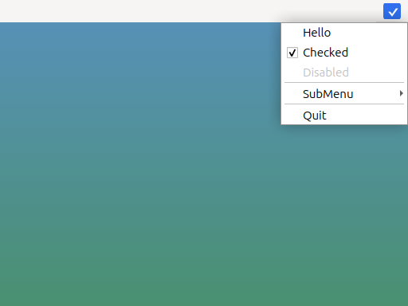
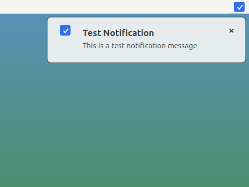
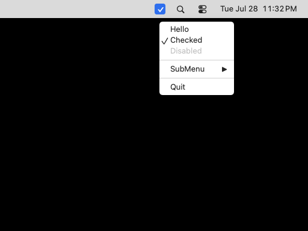
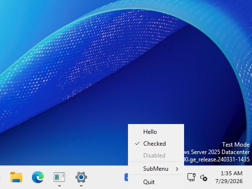

<div align="center">
  
  <h1 align="center">tray</h1>
  <h4 align="center">Cross-platform implementation of a system tray icon with a popup menu and notifications.</h4>
</div>

<div align="center">
  <a href="https://github.com/LizardByte/tray"></a>
  <a href="https://github.com/LizardByte/tray/actions/workflows/ci.yml?query=branch%3Amaster"></a>
  <a href="https://codecov.io/gh/LizardByte/tray"></a>
  <a href="https://sonarcloud.io/project/overview?id=LizardByte_tray"></a>
</div>

# Overview

## ℹ️ About

Cross-platform C++17 Qt-backed system tray icon with a popup menu and notifications.

This is a fork of
[dmikushin/tray](https://github.com/dmikushin/tray) and is intended to add additional features required for our own
[Sunshine](https://github.com/LizardByte/Sunshine) project.

This fork adds the following features:

- system tray notifications
- unit tests
- code coverage
- refactored code, e.g., moved source code into the `src` directory
- doxygen documentation and readthedocs configuration
- all platforms use QT-based implementation

## 🖼️ Screenshots

<div class="tabbed">
<ul>
<li><b class="tab-title">Linux</b><br>




</li>
<li><b class="tab-title">macOS</b><br>



</li>
<li><b class="tab-title">Windows</b><br>




</li>
</ul>
</div>

## 🖥️ Supported platforms

* Linux
* macOS
* Windows

## 📋 Prerequisites

* CMake
* [Ninja](https://ninja-build.org/), to have the same build commands on all platforms.
* C++17 compiler
* Qt5 or Qt6 Widgets and Svg modules

### Platform Dependencies

Install either Qt6 _or_ Qt5.

<div class="tabbed">

- <b class="tab-title">Arch</b>
    ```bash
    # Qt6
    sudo pacman -S qt6-base qt6-svg

    # Qt5
    sudo pacman -S qt5-base qt5-svg
    ```

- <b class="tab-title">Debian/Ubuntu</b>
    ```bash
    # Qt6
    sudo apt install qt6-base-dev qt6-svg-dev

    # Qt5
    sudo apt install qtbase5-dev libqt5svg5-dev
    ```

- <b class="tab-title">Fedora</b>
    ```bash
    # Qt6
    sudo dnf install qt6-qtbase-devel qt6-qtsvg-devel

    # Qt5
    sudo dnf install qt5-qtbase-devel qt5-qtsvg-devel
    ```

- <b class="tab-title">macOS</b>
    ```bash
    brew install cmake ninja qtbase qtsvg
    ```

- <b class="tab-title">Windows (MSYS2 UCRT64)</b>
    ```bash
    pacman -S mingw-w64-ucrt-x86_64-cmake \
      mingw-w64-ucrt-x86_64-ninja \
      mingw-w64-ucrt-x86_64-toolchain \
      mingw-w64-ucrt-x86_64-qt6-base \
      mingw-w64-ucrt-x86_64-qt6-svg
    ```

</div>

## 🛠️ Building

```bash
mkdir -p build
cmake -G Ninja -B build -S .
ninja -C build
```

## ⚙️ Python Tooling

Install [uv](https://docs.astral.sh/uv/) and initialize the shared tooling submodule:

```bash
git submodule update --init --recursive third-party/lizardbyte-common
uv run --project third-party/lizardbyte-common --locked --only-group lint-c \
  python third-party/lizardbyte-common/scripts/update_clang_format.py
```

## ▶️ Demo

Execute the `tray_example` application:

```bash
./build/tray_example
```

## ✅ Tests

Execute the `tests` application:

```bash
./build/tests/test_tray
```

## 📘 Icon formats

The `icon` and `notification_icon` fields can be a path to an image file or an icon theme name. Relative file paths
are resolved from the process working directory, so applications should copy or install icon files where the running
process can find them.

SVG, ICO, PNG, and Qt theme icon names are supported.

For the most predictable cross-platform behavior, use SVG or PNG files for both tray and notification icons. ICO is
supported by the Qt-backed paths tested by this project.
Qt theme icons should be passed as icon name strings, such as `mail-message-new`.

## 📚 API

Tray structure defines an icon and a menu.
Menu is a NULL-terminated array of items.
Menu item defines menu text, menu checked and disabled (grayed) flags and a
callback with some optional context pointer.

```c
struct tray {
  char *icon;
  struct tray_menu *menu;
};

struct tray_menu {
  char *text;
  int disabled;
  int checked;

  void (*cb)(struct tray_menu *);
  void *context;

  struct tray_menu *submenu;
};
```

* `int tray_init(struct tray *)` - creates tray icon. Returns -1 if tray icon/menu can't be created.
* `void tray_update(struct tray *)` - updates tray icon and menu.
* `int tray_loop(int blocking)` - runs one iteration of the UI loop. Returns -1 if `tray_exit()` has been called.
* `void tray_exit()` - terminates UI loop.

All functions are meant to be called from the UI thread only.

Menu arrays must be terminated with a NULL item, e.g. the last item in the
array must have text field set to NULL.

## 📄 License

This software is distributed under [MIT license](http://www.opensource.org/licenses/mit-license.php),
so feel free to integrate it in your commercial products.

<details style="display: none;">
  <summary></summary>
  [TOC]
</details>
